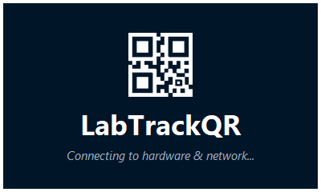
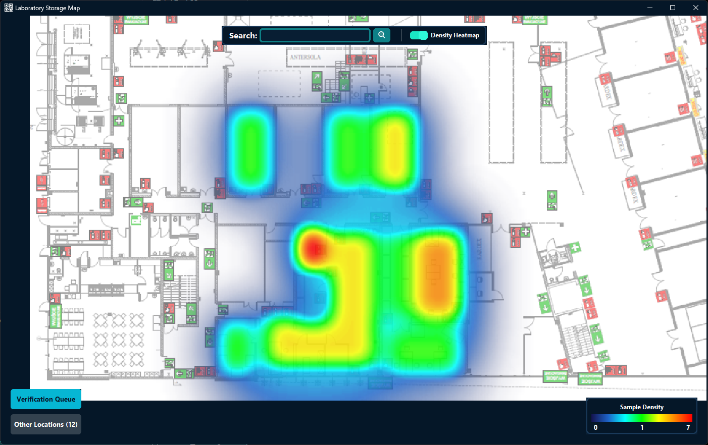
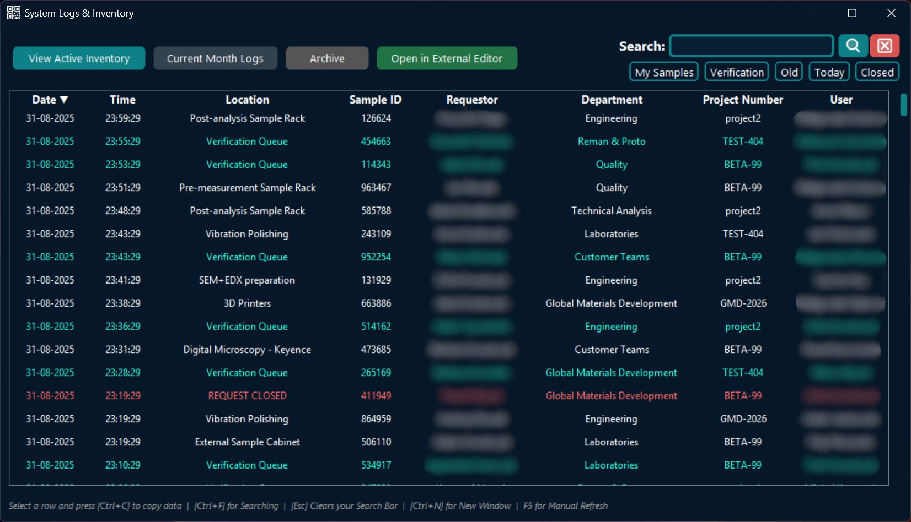

<p align="center">
  
</p>

<p align="center">
  
  
  <a href="https://github.com/xParano1d/LabTrackQR/releases/latest">
    
  </a>
  
</p>
<br>

An enterprise-grade background desktop application designed to intercept, process, and log barcode and QR code scans from physical scanning hardware. 

By establishing a direct Serial (Virtual COM) connection rather than relying on standard HID keyboard emulation, the system captures scan data silently in the background. This ensures users can scan tags without interrupting their active workflow or interfering with other open applications.

<br>

## System Showcase


<p align="center">
  
  <br>
  <em>Interactive Map Viewer featuring real-time density heatmaps.</em>
</p>
<br>
<p align="center">
  
  <br>
  <em>System Logs & Active Inventory Viewer with custom filtering.</em>
</p>

<br>

## Core Features

**Architecture & Synchronization**
* **Separated Client-Server Nodes:** A centralized API server handles global data synchronization and deep database searches, while lightweight client nodes operate across the local network.
* **Resilient Offline Vault:** If the server connection drops, the client seamlessly caches scans locally and automatically pushes the queue to the server once the network is restored.
* **Automated Tiered Backups & Recovery:** The server automatically compresses and archives the master database into tiered zip files (Recent, Hourly, Daily). A dedicated Recovery Center GUI allows administrators to instantly roll back the system state.
* **Single Instance Lock:** Mutex locks prevent multiple application instances from colliding, ensuring data integrity.

<br>

**Inventory & Data Management**
* **Comprehensive Log Viewer:** Features chronological and header-based sorting, dynamic tagging ("My Samples", "Old", "Today", "Verification Queue"), and automated date normalization.
* **Deep Multi-Threaded Search:** Capable of instantly querying both the active inventory and the entire historical CSV archive.
* **Stale Sample Tracking:** Built-in tracking system that monitors inventory lifespans, utilizing strict un-bypassable popups to alert users upon login if any of their samples have been left unattended for over 14 days.
* **Validated Manual Entry:** Forms for manual sample initialization with dynamic input validation and visual error states.

<br>

**Hardware & User Management**
* **Direct Serial Hardware Integration:** Serial COM port monitoring bypasses HID keyboard input, featuring a self-healing watchdog that automatically restores connections if a scanner is unplugged.
* **Multi-User & Active Directory Support:** Seamlessly handles shared workstations. Scanners lock to specific user badges and automatically revert to the default Windows AD user after 5 minutes of scanner inactivity.
* **Centralized Employee Directory:** Server-side management interface to register users, link AD accounts, and automatically generate printable login QR codes.
* **Secure Removal Mode:** Dedicated removal state with multi-step validation to prevent accidental sample deletions from unauthorized scans.

<br>

**Modern UI/UX**
* **Hardware-Accelerated Interface:** Built on CustomTkinter for a responsive, modern aesthetic. 
* **Dynamic Theming:** Fully themeable (Light/Dark mode synced with OS or custom `BW_theme.json`) with unified color palettes across all windows.
* **Kinetic Feedback:** Smooth 120FPS slide-in/out animations for the notification system, shaking animations for invalid form inputs, and pulsing borders for critical alerts.
* **Adaptive Navigation:** Windows automatically scale to user DPI and monitor dimensions, featuring collapsible menus on smaller displays.

<br>

## Hardware Configuration

*<b>Hardware Compatibility Warning!</b>* <br>This application has been exclusively developed for and tested with the **Zenwire w213** QR Scanner. Functionality, baud rate sync, and COM port behavior with other brands or models have not been tested and are not guaranteed.

For the application to capture data correctly, the physical scanner must be configured using the exact control barcodes provided in the manufacturer's documentation. Scanners default to HID keyboard emulation out of the box, which will not work with this application.

**Configuration Instructions:**
Do not use the legacy text notes for setup. You must scan the configuration codes from the `Scanner Configuration Manual.pdf` located at `docs/` in exact order as provided.

<br>

### Installation Process
Clone the repository and install the required dependencies:
```bash
git clone https://github.com/xParano1d/LabTrackQR.git
cd LabTrackQR
pip install -r requirements.txt
```

<br>

## Compiling to Standalone Executables

To distribute LabTrackQR without requiring a local Python environment on host machines, you must compile the applications into standalone Windows executables (`.exe`).
*This utilizes **PyInstaller**, which is included in the project dependencies.*

Open your terminal in the root project folder (the folder containing `src` and `img` directories) and execute the relevant build commands below.
<br>

### Build Client:
```bash
python -m PyInstaller --onefile --noconsole --collect-all customtkinter --collect-all ctkfontawesome --icon="img\iconApp.ico" --add-data "img/*;." --paths src src\Client\main.py --name=LabTrackQR
```

### Build Server:
```bash
python -m PyInstaller --onefile --noconsole --collect-all customtkinter --collect-all ctkfontawesome --icon="img\iconApp.ico" --add-data "img/*;." --paths src src\Server\main.py --name=LabTrackQR-Server
```

### Build Map Config Creator:
```bash
python -m PyInstaller --noconsole --onefile --windowed --icon="img\iconApp.ico" --collect-all customtkinter --collect-all ctkfontawesome --add-data "img\BW_theme.json;." "src\server\mapCreator.py" --name="MapCreator" 
```


### Build Command Breakdown

* `--onefile`: Compresses all libraries and scripts into a single `.exe` file.
* `--noconsole`: Hides the standard background terminal window during execution.
* `--icon="img\iconApp.ico"`: Assigns the custom application logo to the Windows file.
* `--add-data "img/*;."`: Bundles the required images directly inside the `.exe` to ensure System Tray icons and UI assets render correctly.
* `--paths src`: Directs the compiler to include internal project modules.

<br>

### Locating the Output

Once the compilation process finishes, your packaged executables will be located inside the newly generated `dist/` folder within your project directory. These `.exe` files are fully portable and can be distributed to user workstations.
